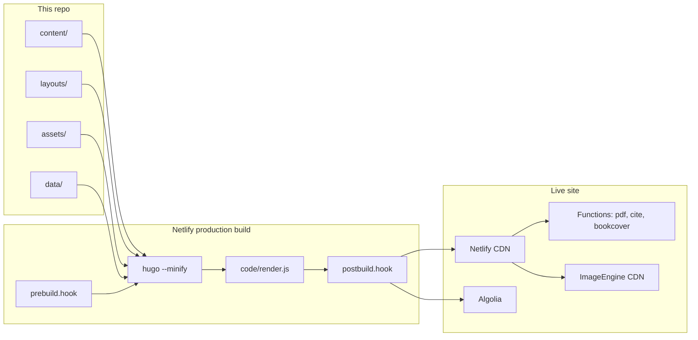

# Architecture

Peaceful Science is a content site about science, faith, and the question *what does it mean to be human?* The GitHub repo is the source of truth: articles, books, preprints, and most of the presentation live here. A Discourse forum at `discourse.peacefulscience.org` may still exist as a separate site; **this repo’s Discourse integration is defunct** (no auto-share, not a publishing dependency). Historical `commenturl` values and forum links in article bodies are leftover content.

The published site is **static HTML** hosted on **Netlify**. Hugo renders Markdown into `public/`. A post-render Node step mutates that HTML. Netlify also runs a few on-demand functions. There is **no working front-end admin**; the source of edits is this git repo.

Intended direction (admin UI, Word ingest, Crossref/Algolia, SEO/JSON-LD, possible S3/backend change) is in [goals](goals.md). Live crawler/structured-data inventory is in [seo.md](seo.md).

## Layers

### Content (`content/`)

Markdown (and a few HTML) files with YAML front matter. Hugo sections:

| Section | Role |
| --- | --- |
| `articles/` | Main blog / essays |
| `prints/` | Preprints and postprints (treated as scholarly; DOIs, print/PDF output) |
| `prints/excerpts/` | Book excerpts |
| `prints/deleted/` | Archived copies of articles removed elsewhere |
| `books/` | Book pages (Amazon IDs, related-article lists) |
| `newsletter/` | Newsletter issue pages (HTML). Mailchimp *campaigns* are a local Make CLI, not the Netlify build |
| `authors/` | Author bios; also a Hugo taxonomy |
| `categories/`, `series/` | Taxonomy term pages |
| `about/` | Mission, editorial policy, author's guide |
| `archive/` | Paginated dump of all regular pages |
| `forum/` | Marketing page that pointed at Discourse (integration defunct) |
| `news/` | A leftover news item (not a first-class nav section) |
| `jsonld/` | Headless Organization schema fragment |

Home, contact, search, and 404 are top-level files in `content/`.

### Templates (`layouts/`)

This site does **not** use a Hugo theme in `config.yml`. The `themes/hyde-x` git submodule is leftover from an earlier stack. All presentation is custom:

- `layouts/_default/baseof.html` — chrome (nav, footer, video overlay, subscribe modal)
- `layouts/_default/single.html` — article/print page (JSON-LD, authors, header image/YouTube, footnotes-as-sidenotes, related pages, Suggest Changes)
- `layouts/_default/list.html` — section and taxonomy lists
- `layouts/index.html` — homepage composition (latest, featured, topic slices)
- `layouts/books/single.html` — book pages with Amazon cover and related articles
- `layouts/_default/single.print.html` + `baseof.print.html` — Prince input HTML at `/_prince/…` (not a public page; `noindex` + robots Disallow). Keep Schema.org microdata for Prince. **`render.js` still runs on these files** (footnotes, strip `[remove]` scripts, **render** MathJax to SVG) before Prince fetches them. Do not index this output.
- `layouts/_default/list.algolia.json` — search index
- `layouts/_default/index.redir` — Netlify `_redirects`
- `layouts/_default/home.xref*.xml` — Crossref DOI deposit XML
- `layouts/_default/_markup/` — custom Markdown render hooks for headings, images, and links
- `layouts/partials/` — reusable pieces (SEO, JSON-LD, images, authors, Crossref, cards)
- `layouts/shortcodes/` — `image`, `youtube`, `pdf`, `amazon`, `facebook`, `mediatext`, etc.

Homepage and cards use `partial "render"` which picks `layouts/partials/render/_default.html` (or a type-specific render partial).

### Assets and static files

- **CSS:** **Destination is Tailwind.** Today production still compiles Bootstrap 4 SCSS from `assets/css/main.scss` (plus Font Awesome) through Hugo `resources.ToCSS` + PostCSS (PurgeCSS, autoprefixer, cssnano). A parallel Tailwind pipeline exists (`sources/tailwind.css`, `tailwind.config.js`, `npm run tailwind` → `assets/css/tw.css`) but is **commented out** of `code/production` and `head.html`, and `tw.css` is gitignored. Cleanup should turn Tailwind on and migrate remaining Bootstrap/custom SCSS onto it — not delete the Tailwind files.
- **JS:** `assets/js/turbo.js` is the entry. Hugo `js.Build` bundles Hotwired Turbo, navbar, TOC progress, YouTube player, and (empty) subscribe helpers. Search is a separate InstantSearch bundle on the search layout.
- **Images / PDFs:** `static/img` and `static/pdf` are **Git LFS** (Netlify Large Media as the LFS store). **Netlify builds do not download LFS objects** — the clone has pointer files, not pixels. Hugo therefore cannot read image dimensions at build time. **`data/imgsize.json` is required sidecar:** keys like `/img/2024/07/foo.jpg` → `{width, height}`. Templates (`render-image.html`, `image` / `mediatext` shortcodes, header images) set `width`/`height` from that map. Adding or replacing an image is incomplete until `make imginfo` runs **where the real files exist** and the JSON is committed. Do not regenerate this file on Netlify (`imgsize.py` would skip pointers and empty the map). `data/pdfinfo.json` is git lastmod for uploaded PDFs (does not need file bytes). **Page PDFs** are Prince of `_prince` HTML — Lambda, or LFS at `static/pdf/<section>/<slug>.pdf` when over ~6 MB. See [build-and-deploy](build-and-deploy.md#article-pdfs-prince) and [images](build-and-deploy.md#git-lfs-and-image-sizes).
- **Image CDN:** Production templates rewrite image URLs to ImageEngine (`8l2ic7fx.cdn.imgeng.in`) via `partials/imgcdn.html`. **Origin is the Netlify live site** (Large Media). If binaries move to S3, point ImageEngine at that bucket instead. Local `hugo server` serves files from `static/` when they exist.

### Data files (`data/`) — sidecar pattern

Generated and lookup tables live here so **article markdown is not rewritten** for machine output. `enableGitInfo: true` makes Hugo `.Lastmod` the last git commit of that content file. The page “modified” date, sitemap `<lastmod>`, Algolia `lastmod`, and JSON-LD `dateModified` all follow that. Assigning a DOI, caching a citation, or storing detected entities must update a sidecar file, not the article.

Canonical example: **`doi.json`**. Keys are permalinks (`/articles/foo/`). `partials/getdoi.html` reads the map; a `doi:` key in front matter is legacy (`DOI.OLD`).

| File | Purpose |
| --- | --- |
| `doi.json` | Path → DOI under prefix `10.54739` |
| `imgsize.json` | Image width/height. **Required at Netlify build** because LFS files are not downloaded. Update with every new/changed image (`make imginfo` locally). |
| `pdfinfo.json` | Static PDF lastmod for the sitemap |
| `dates.json` | Created/modified unix times from git (Husky pre-commit on `content/`) |
| `urlmap.json` | URL rewrites used by the link render hook |
| `citation.json` / `citationredirect.json` | Citation metadata cache (URL → CSL-JSON or error) |
| `lastmod.json` | Optional lastmod overrides (`partials/lastmod.html`; currently empty, and the partial is unused by `single.html`) |
| `tweet.json` / `tweetAPI.json` | Tweet embed caches |

Analytics JSON (`mostread.json`, `trending.json`, `ytd.json`) is gitignored. It came from **defunct** UA (`update_analytics.py` / `PeacefulScience/analytics`). Near-term: delete that path; do not treat it as live data.

**Counterexample:** `make news` writes `mailchimp.campaign_id` into the newsletter markdown. New generated ids should follow `doi.json` instead. Product rule: [goals](goals.md) (sidecar data).

### Build scripts (`code/`)

| Script | Role |
| --- | --- |
| `production` | What Netlify production runs: TASKS (default `BUILD`) → prebuild → hugo → render.js → postbuild |
| `prebuild.hook` | Optional `CACHE`. `ANALYTICS` is **defunct UA** — do not enable. |
| `postbuild.hook` | Optional `CROSSREF` / `ALGOLIA` (DAILY, gated on `TODAY`). `DISCOURSE` still exists in the script and is **defunct** — do not enable. |
| `render.js` | Post-process **every** `public/**/*.html` file, **including `_prince/`**: run `script[render]`, strip `[remove]` (browser scripts), **render** TeX to SVG when `[mathjax]` is set (inline math is rendered, not stripped), collect CSS classes. Prince PDFs use this HTML. |
| `doi.py` | **CLI only** (`make doi`). Writes `data/doi.json`. Not called on Netlify. |
| `newsletter/` | **CLI only** (`make news`). MJML + Mailchimp campaign upsert. Not called on Netlify. |
| `imgsize.py` / `pdfinfo.py` | **CLI only** (`make imginfo` / `pdfinfo`). Refresh committed JSON. `imginfo` **must** run on a machine that has smudged LFS files. |
| `document.py` | Parse Markdown front matter (newsletter CLI; also used by the defunct Discourse share script) |
| `update_analytics.py` | **Defunct UA** (Reporting API v3). Near-term delete. |
| `extract.js` | RDF extract; commented out of production |
| `wordpress.py` / `wp-migrate.py` | WordPress migration leftovers |

### Netlify Functions (`functions/`)

Routed from `layouts/partials/redirects.html` / `_redirects`:

| Function | Path | What it does |
| --- | --- | --- |
| `pdf/index.js` | `/pdf/*` | On-demand Prince PDF from live `/_prince/...` HTML (**after `render.js`**). Fails if the PDF is over ~**6 MB**; those pages need a committed LFS file at `static/pdf/<section>/<slug>.pdf` |
| `cite.js` | `/cite/*` | Citation JSON from DOI.org or Manubot |
| `bookcover.js` | `/img/bookcover/*` | Proxy Amazon cover images |
| `daily-build.js` | scheduled `0 14 * * *` | POST `"DAILY"` to `BUILD_HOOK` to rebuild |

The PDF function only allows sections `articles`, `about`, and `prints`. Netlify `included_files` in `netlify.toml` packs the Prince binary into the function bundle. Static files under `public/pdf/` (from `static/pdf/`) shadow this rewrite.

### Integrations (see also [build-and-deploy](build-and-deploy.md))

- **Algolia** index `PeacefulScience` — **still the live search backend.** Hugo always writes `algolia.json` on production BUILD. Upload runs only on the **DAILY** hook when the Hugo log contains `TODAY` (`atomic-algolia`). That hook is still configured and wanted. Git-push production does not upload.
- **Crossref** — **account active.** Hugo always emits three XML batches during BUILD. Deposit (`doMDUpload`) runs only on **DAILY** + `TODAY`. **Admins assign** DOIs (`make doi` locally → `data/doi.json`); that file must be committed before a build can show or deposit a new id.
- **Discourse** — **integration defunct.** `share_discourse.py` / `DISCOURSE` task: do not restore. Many articles still have `commenturl` and a “Discuss on Forum” button; treat as leftover UI. `content/forum/` is a marketing page. Body links to `discourse.peacefulscience.org` are ordinary URLs.
- **Mailchimp** — on-site subscribe forms POST to Mailchimp. Composing a campaign is `make news` on a laptop, not the Netlify build.
- **OneSignal** — web push, still configured with WordPress plugin SDK paths.
- **Google Tag Manager** `GTM-KDF8R85` loads in production (`head.html` + noscript in `baseof.html`), gated on `config.yml` `googleAnalytics: G-BHPH29YM44`. **`turbo:load` still calls Universal Analytics `ga('send', 'pageview')`**, which is defunct. Near-term: remove UA and push real pageviews on Turbo navigations ([goals](goals.md#tracking-near-term)). View-count sidecars (`update_analytics.py`, `byviews.html`) are UA v3 leftovers.
- **Netlify Forms** — `content/contact.html`.
- **CMS admin UI** — Decap at `static/admin/` and Forestry at `.forestry/` are **not working**. Editing is GitHub only. **Stack undecided**; candidate is Decap + GitHub Actions for sidecar processes ([goals](goals.md) §1).

## Notable template behaviors

**Goldmark is `unsafe: true`**, so Markdown can include raw HTML (editor notes, dropcaps, shortcodes).

**Link render hook** (`layouts/_default/_markup/render-link.html`) classifies internal / external / forum / PDF / DOI links, records them on the page scratch for “related” / book backrefs, and can dump every link when `HUGO_LINKS=1`.

**“Suggest Changes”** is a GitHub edit URL: `https://github.com/PeacefulScience/peacefulscience.org/edit/master/content/<path>`. Revision history is the commits URL for the same file.

**Today’s pages:** `single.html` warns `TODAY <path>` when `PublishDate` is today. Postbuild uses that log line as a gate for Crossref and Algolia (the Discourse branch of that gate is defunct).

**Lastmod:** with `enableGitInfo`, `.Lastmod` is the content file’s last commit. Do not bump it by writing generated fields into the article; use sidecar `data/` files ([goals](goals.md)).

**JSON-LD** is data-driven. Front matter `jsonld:` maps (and `= permalink`-style directives) are resolved by `layouts/partials/jsonld/`. Articles cascade a Schema.org `Article` template from `content/articles/_index.md` (`sameAs`, DOI `identifier`, `ImageObject`). Remaining SearchAction vs InstantSearch routing is in [seo.md](seo.md) / [goal 9](goals.md#9-seo-json-ld-and-ai-utilization). Unused `layouts/partials/seo/structured/` is not on this path.

**Related content** uses Hugo `related` (categories, authors, section) plus optional `series` union.

## Client runtime

Turbo intercepts navigation and swaps `#app` instead of the whole body, so the YouTube overlay and subscribe modal persist. Navbar JS is custom (Bootstrap’s JS is not the driver). Font variant JS (`fontvar.js`) exists to randomize stylistic alternates on headings but is not imported by `turbo.js`. AMP layouts exist and are **not** in the default outputs — AMP is defunct.
