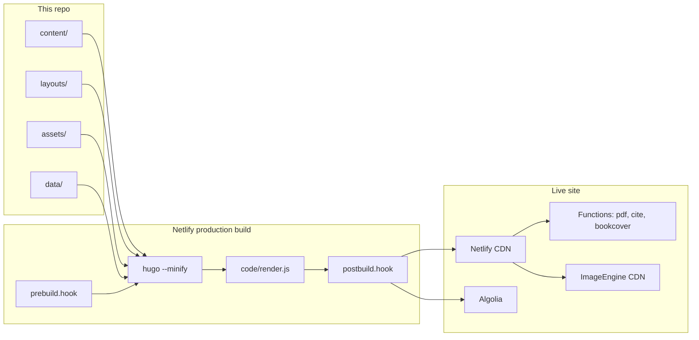

# Architecture

Peaceful Science is a content site about science, faith, and the question *what does it mean to be human?* The GitHub repo is the source of truth: articles, books, preprints, and most of the presentation live here. A Discourse forum at `discourse.peacefulscience.org` is a separate product; this repo only links to it and (optionally) posts there.

The published site is **static HTML** hosted on **Netlify**. Hugo renders Markdown into `public/`. A post-render Node step mutates that HTML. Netlify also runs a few on-demand functions. There is **no working front-end admin**; the source of edits is this git repo.

Intended direction (admin UI, Word ingest, Crossref/Algolia, possible S3/backend change) is in [goals](goals.md).

## Layers

### Content (`content/`)

Markdown (and a few HTML) files with YAML front matter. Hugo sections:

| Section | Role |
| --- | --- |
| `articles/` | Main blog / essays |
| `prints/` | Preprints and postprints (treated as scholarly; DOIs, print/PDF output) |
| `prints/excerpts/` | Book excerpts |
| `prints/deleted/` | Archived copies of articles removed elsewhere |
| `books/` | Book pages (Amazon IDs, related-article lists) |
| `newsletter/` | Newsletter issue pages (HTML). Mailchimp *campaigns* are a local Make CLI, not the Netlify build |
| `authors/` | Author bios; also a Hugo taxonomy |
| `categories/`, `series/` | Taxonomy term pages |
| `about/` | Mission, editorial policy, author's guide |
| `archive/` | Paginated dump of all regular pages |
| `forum/` | Marketing page that points at Discourse |
| `news/` | A leftover news item (not a first-class nav section) |
| `jsonld/` | Headless Organization schema fragment |

Home, contact, search, and 404 are top-level files in `content/`.

### Templates (`layouts/`)

This site does **not** use a Hugo theme in `config.yml`. The `themes/hyde-x` git submodule is leftover from an earlier stack. All presentation is custom:

- `layouts/_default/baseof.html` — chrome (nav, footer, video overlay, subscribe modal)
- `layouts/_default/single.html` — article/print page (JSON-LD, authors, header image/YouTube, footnotes-as-sidenotes, related pages, Suggest Changes)
- `layouts/_default/list.html` — section and taxonomy lists
- `layouts/index.html` — homepage composition (latest, featured, topic slices)
- `layouts/books/single.html` — book pages with Amazon cover and related articles
- `layouts/_default/single.print.html` + `baseof.print.html` — Prince XML print stylesheet for PDF generation
- `layouts/_default/list.algolia.json` — search index
- `layouts/_default/index.redir` — Netlify `_redirects`
- `layouts/_default/home.xref*.xml` — Crossref DOI deposit XML
- `layouts/_default/_markup/` — custom Markdown render hooks for headings, images, and links
- `layouts/partials/` — reusable pieces (SEO, JSON-LD, images, authors, Crossref, cards)
- `layouts/shortcodes/` — `image`, `youtube`, `pdf`, `amazon`, `facebook`, `mediatext`, etc.

Homepage and cards use `partial "render"` which picks `layouts/partials/render/_default.html` (or a type-specific render partial).

### Assets and static files

- **CSS:** Bootstrap 4 SCSS imported from `node_modules` via `assets/css/main.scss`, plus Font Awesome. Hugo `resources.ToCSS` + PostCSS (PurgeCSS, autoprefixer, cssnano). Tailwind scripts exist but the production pipeline does not run them; Tailwind output is gitignored.
- **JS:** `assets/js/turbo.js` is the entry. Hugo `js.Build` bundles Hotwired Turbo, navbar, TOC progress, YouTube player, and (empty) subscribe helpers. Search is a separate InstantSearch bundle on the search layout.
- **Images / PDFs:** `static/img` and `static/pdf`, stored in **Git LFS** and served through **Netlify Large Media**. At build time, `data/imgsize.json` and `data/pdfinfo.json` record dimensions / last-modified for templates.
- **Image CDN:** Production templates rewrite image URLs to ImageEngine (`8l2ic7fx.cdn.imgeng.in`) via `partials/imgcdn.html`. Local `hugo server` serves files from `static/` when they exist.

### Data files (`data/`)

Used as a side channel so templates do not have to recompute or call APIs:

| File | Purpose |
| --- | --- |
| `doi.json` | Path → DOI under prefix `10.54739` |
| `imgsize.json` | Image width/height |
| `pdfinfo.json` | Static PDF lastmod for the sitemap |
| `dates.json` | Created/modified unix times from git (Husky pre-commit) |
| `urlmap.json` | URL rewrites used by the link render hook |
| `citation.json` / `citationredirect.json` | Citation metadata |
| `lastmod.json` | Lastmod overrides |
| `tweet.json` / `tweetAPI.json` | Tweet embeds |

Analytics JSON (`mostread.json`, `trending.json`, `ytd.json`) is gitignored and, when used, fetched from the `PeacefulScience/analytics` repo or generated by `code/update_analytics.py`.

### Build scripts (`code/`)

| Script | Role |
| --- | --- |
| `production` | What Netlify production runs: TASKS (default `BUILD`) → prebuild → hugo → render.js → postbuild |
| `prebuild.hook` | Optional `ANALYTICS` / `CACHE` (not on git-push or DAILY) |
| `postbuild.hook` | Optional `CROSSREF` / `ALGOLIA` / `DISCOURSE` (DAILY enables the first two, gated on `TODAY`) |
| `render.js` | Post-process every HTML file: run `script[render]`, strip `[remove]`, optional MathJax, collect CSS classes |
| `doi.py` | **CLI only** (`make doi`). Writes `data/doi.json`. Not called on Netlify. |
| `newsletter/` | **CLI only** (`make news`). MJML + Mailchimp campaign upsert. Not called on Netlify. |
| `imgsize.py` / `pdfinfo.py` | **CLI only** (`make imginfo` / `pdfinfo`). Refresh committed JSON. |
| `document.py` | Parse Markdown front matter (newsletter CLI and Discourse) |
| `update_analytics.py` | UA v3 → cache JSON (`ANALYTICS` task only) |
| `extract.js` | RDF extract; commented out of production |
| `wordpress.py` / `wp-migrate.py` | WordPress migration leftovers |

### Netlify Functions (`functions/`)

Routed from `layouts/partials/redirects.html` / `_redirects`:

| Function | Path | What it does |
| --- | --- | --- |
| `pdf/index.js` | `/pdf/*` | On-demand PDF via Prince from `/_prince/...` HTML |
| `cite.js` | `/cite/*` | Citation JSON from DOI.org or Manubot |
| `bookcover.js` | `/img/bookcover/*` | Proxy Amazon cover images |
| `daily-build.js` | scheduled `0 14 * * *` | POST `"DAILY"` to `BUILD_HOOK` to rebuild |

The PDF function only allows sections `articles`, `about`, and `prints`. Netlify `included_files` in `netlify.toml` packs the Prince binary into the function bundle.

### Integrations (see also [build-and-deploy](build-and-deploy.md))

- **Algolia** index `PeacefulScience` — Hugo always writes `algolia.json` on production BUILD. Upload runs only on the **DAILY** hook when the Hugo log contains `TODAY` (`atomic-algolia`). Git-push production does not upload. Client search uses InstantSearch (`assets/js/search.js`).
- **Crossref** — Hugo always emits three XML batches during BUILD. Deposit (`doMDUpload`) runs only on **DAILY** + `TODAY`. **Assigning** a new DOI (`make doi`) is local: it only edits `data/doi.json`, which must be committed before a build can show or deposit it.
- **Discourse** — `commenturl` front matter plus “Discuss on Forum”. `share_discourse.py` is a postbuild task that DAILY currently omits.
- **Mailchimp** — on-site subscribe forms POST to Mailchimp. Composing a campaign is `make news` on a laptop, not the Netlify build.
- **OneSignal** — web push, still configured with WordPress plugin SDK paths.
- **Google Tag Manager** `GTM-KDF8R85` plus `googleAnalytics: G-BHPH29YM44` in config (the template still calls Universal Analytics `ga('send')` on Turbo navigations).
- **Netlify Forms** — `content/contact.html`.
- **CMS admin UI** — Decap files at `static/admin/` (`/admin/`) and Forestry at `.forestry/` are **not working**. Editing is GitHub only.

## Notable template behaviors

**Goldmark is `unsafe: true`**, so Markdown can include raw HTML (editor notes, dropcaps, shortcodes).

**Link render hook** (`layouts/_default/_markup/render-link.html`) classifies internal / external / forum / PDF / DOI links, records them on the page scratch for “related” / book backrefs, and can dump every link when `HUGO_LINKS=1`.

**“Suggest Changes”** is a GitHub edit URL: `https://github.com/PeacefulScience/peacefulscience.org/edit/master/content/<path>`. Revision history is the commits URL for the same file.

**Today’s pages:** `single.html` warns `TODAY <path>` when `PublishDate` is today. Postbuild uses that log line as a gate for Crossref, Algolia, and Discourse.

**JSON-LD** is data-driven. Front matter `jsonld:` maps (and `= permalink`-style directives) are resolved by `layouts/partials/jsonld/`. Articles cascade a Schema.org `Article` template from `content/articles/_index.md`.

**Related content** uses Hugo `related` (categories, authors, section) plus optional `series` union.

## Client runtime

Turbo intercepts navigation and swaps `#app` instead of the whole body, so the YouTube overlay and subscribe modal persist. Navbar JS is custom (Bootstrap’s JS is not the driver). Font variant JS (`fontvar.js`) exists to randomize stylistic alternates on headings but is not imported by `turbo.js`.
